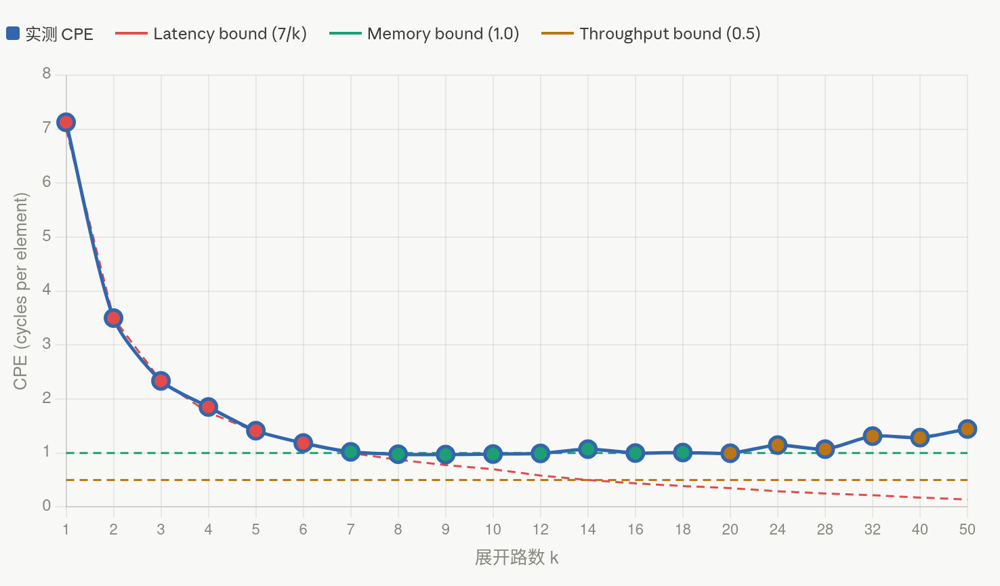

# XJTU-ICS Lab5：Opt Lab

> 💡 **写在前面（一点碎碎念）：**
> 本文记录的解法，**绝非唯一答案，更不代表最优解**（~~另外文章当中还可能存在未被发现的bug🪲~~）。
> Lab 的灵魂就在于死磕的过程，**强烈建议你在看本文前先独立思考、自己多碰几次壁**。代码仅供卡壳时对齐思路，**请勿直接抄袭**——相信我，独立通关的成就感，远比直接抄个 100 分要爽得多😉

# OptLab


## Part A：性能测量

### 选择时钟

题目要求测量 `poly()` 函数的运行时间，单位纳秒。Linux 下有几个候选函数：

- `clock()`：微秒粒度，太粗
- `gettimeofday()`：微秒粒度，太粗
- `clock_gettime()`：可达纳秒粒度，有多种时钟可选


这里我们选择了第三种，看起来更加精确一点（当然其他两种可能也是可行的，这里笔者没有测试，读者若有兴趣可以自行测试并比较差异）

`clock_gettime()` 的原型：

```c
int clock_gettime(clockid_t clk_id, struct timespec *tp);

struct timespec {
    time_t tv_sec;   // 秒
    long   tv_nsec;  // 纳秒
};
```

**第一个参数 clk_id，它决定用哪种时钟。常用的有以下几个：**

- `CLOCK_REALTIME`：墙钟时间，会被 NTP 等系统调整，不稳定
- `CLOCK_MONOTONIC`：单调递增，适合测间隔，但包含进程被换出的时间
- `CLOCK_PROCESS_CPUTIME_ID`：只计算当前进程实际占用 CPU 的时间

我们测量的是 CPU 真实执行时间，不希望进程被调度换出的时间混入结果。所以选 **`CLOCK_PROCESS_CPUTIME_ID`**。（事实上经过测试，MONOYONIC也能很好的完成测量）

---

为了避免调用函数的开销，我们通过测量多次取平均的方式：

`poly()` 在 degree=5000 时跑一次大约：

```
5000 元素 × 7 CPE ÷ 2,600,000,000 Hz ≈ 13,500 纳秒 ≈ 13.5 微秒
```

单次测量有两个问题：
1. `clock_gettime()` 本身有调用开销（几十到几百纳秒），占比不可忽略
2. 时钟精度有限，单次结果噪声大

**解决方案：循环多次测量取平均**，选 100~1000 次，让总测量时间远大于时钟调用开销。

但实际发现其实不需要测量多次也可以完成任务（在误差允许范围内）

---

**Cache 预热**

测试框架在调用 `measure_time()` 前会清空 cache，所以要在**计时开始前先执行一遍 `poly()`**，把数组数据载入 L1 cache，避免 cache miss 污染测量结果。

---
这里需要注意的一点是我们必须引入<time.h>这个头文件，在poly.c开头加入下面这行代码即可
```
#include<tim.h>
```


### `measure_time()` 最终结构

```c
void measure_time(poly_func_t poly, const double a[], double x, long degree,
                  double *time) {
    // your code here
    struct timespec start, end;
    double result;
    int cnt = 0;
    poly(a, x, degree, &result); 
    clock_gettime(CLOCK_PROCESS_CPUTIME_ID, &start);
    while(cnt<1000){
        poly(a, x, degree, &result);
        cnt++;
    }
    clock_gettime(CLOCK_PROCESS_CPUTIME_ID, &end);
    *time = ((end.tv_sec - start.tv_sec) * 1e9 + (end.tv_nsec - start.tv_nsec))/1000.0;
}
```

**Part A 结果**：测得 `poly()` CPE ≈  7.053900，与参考值完全吻合，满分通过。

---

## Part B：代码优化

### 理解性能瓶颈

原始 `poly()` 使用秦九韶算法：

```c
void poly(const double a[], double x, long degree, double *result) {
    long i;
    double r = a[degree];
    for (i = degree - 1; i >= 0; i--) {
        r = a[i] + r * x;
    }
    *result = r;
}
```

每次循环：`r = a[i] + r * x`

查鲲鹏920手册，开启 `-O2` 后编译器会把 `a[i] + r * x` 合并成一条 **`FMADD`**（fused multiply-add）指令：

| 指令 | Latency | Throughput |
|------|---------|------------|
| FMADD | 7 cycles | 2/cycle |

**数据依赖分析**：每次 `r` 的更新都依赖上一次的 `r`，形成串行依赖链。CPE 下界 = FMADD Latency = **7**，与测量值完全吻合。

理论 Throughput Bound = 1/2 = **0.5**，但实验参考 CPE 是 **1.0**（思考题：为什么是1而不是0.5？答案在最后）。

---

### 优化思路：多路并行展开(循环展开)

要打破 Latency bound，需要消除路间数据依赖。方法：用 **k 个独立累积变量**，每个变量负责间隔 k 个系数，各路之间没有依赖，可以并行填满流水线。

**k 选多少？**

想象单个变量的情况：
```
第1次：r0 = a[i] + r0 * x    （需要等上一次r0，latency=7）
第2次：r0 = a[i-1] + r0 * x  （必须等第1次完成才能开始）
```
所以单个变量，两次更新之间强制间隔7个cycle，CPE=7。

现在用2个变量：
```
cycle 1: r0 = a[i]   + r0 * x
cycle 1: r1 = a[i-1] + r1 * x  （r1和r0没有依赖，可以同时发射！）
cycle 8: r0 = a[i-2] + r0 * x  （等r0的latency=7）
cycle 8: r1 = a[i-3] + r1 * x
```
r0 相邻两次更新间隔还是7个cycle，没有突破。
那如果用7个变量呢？ r0 的第一次更新完成时，恰好轮到第二次更新，间隔刚好够7。
所以 k 至少需要等于 Latency = 7，才能保证流水线不停顿。


要让流水线不停顿，相邻两次对同一变量的更新间隔必须 ≥ Latency = 7。所以 k 至少选 **7**，实际可以多试几个值找最优点。

---

于是我们将多项式分为7组，分别独立处理，最后再进行合并（但需要注意，因为不第一定恰好分为7组，需要一个尾部循环（处理剩余的 `i < 6` 的元素））

```c
double r0 = 0.0, r1 = 0.0, r2 = 0.0, r3 = 0.0;
double r4 = 0.0, r5 = 0.0, r6 = 0.0;

for (i = degree; i >= 6; i -= 7) {
    r0 = a[i]   + r0 * x7;
    r1 = a[i-1] + r1 * x7;
    r2 = a[i-2] + r2 * x7;
    r3 = a[i-3] + r3 * x7;
    r4 = a[i-4] + r4 * x7;
    r5 = a[i-5] + r5 * x7;
    r6 = a[i-6] + r6 * x7;
}
```

---

合并公式的浮点精度问题：

主循环结束后，7路结果需要合并。我最初写的是：

```c
r0 = r0 + r1*x + r2*x2 + r3*x2*x + r4*x4 + r5*x4*x + r6*x4*x2;
```

逻辑上 `r1` 比 `r0` 低1次，`r2` 低2次，补上对应的 `x` 幂次。

**问题**：这个一步合并的方式引入了额外的浮点运算，导致结果与原始 `poly()` 的浮点误差超过 `1e-10` 的阈值。误差不大（`~1e-4`），但正负随机，说明是浮点运算顺序不同导致的精度差异。

**解决方案**：用**秦九韶方式顺序合并**，保持与原始算法完全相同的运算结构：

```c
r0 = r0 * x + r1;
r0 = r0 * x + r2;
r0 = r0 * x + r3;
r0 = r0 * x + r4;
r0 = r0 * x + r5;
r0 = r0 * x + r6;
```

这样每一步都是标准秦九韶操作，浮点精度与原始函数一致，误差完全消除。

---


### 最终代码

```c
void poly_optim(const double a[], double x, long degree, double *result) {
    long i;
    double x2 = x * x;
    double x4 = x2 * x2;
    double x7 = x4 * x2 * x;
    
    double r0 = 0.0, r1 = 0.0, r2 = 0.0, r3 = 0.0;
    double r4 = 0.0, r5 = 0.0, r6 = 0.0;
    
    // 7路并行秦九韶，每路步进7，乘x^7
    for (i = degree; i >= 6; i -= 7) {
        r0 = a[i]   + r0 * x7;
        r1 = a[i-1] + r1 * x7;
        r2 = a[i-2] + r2 * x7;
        r3 = a[i-3] + r3 * x7;
        r4 = a[i-4] + r4 * x7;
        r5 = a[i-5] + r5 * x7;
        r6 = a[i-6] + r6 * x7;
    }
    
    // 用秦九韶方式合并7路结果，保持浮点精度
    r0 = r0 * x + r1;
    r0 = r0 * x + r2;
    r0 = r0 * x + r3;
    r0 = r0 * x + r4;
    r0 = r0 * x + r5;
    r0 = r0 * x + r6;
    
    // 处理剩余元素（i < 6 的部分）
    for (; i >= 0; i--) {
        r0 = a[i] + r0 * x;
    }
    
    *result = r0;
}
```

**最终结果**：CPE ≈ 1.009526，满分100分通过。

---

## 思考题解答

### 为什么 CPE 是 1 而不是 0.5？

FMADD 的 Throughput 是 2/cycle，理论 Throughput Bound 应该是 0.5。

但实际瓶颈是**内存带宽**。每次循环需要从数组中 load 7个 `double`（7×8=56 bytes），而 L1 cache 的 load throughput 是 1/cycle，所以每7个元素需要7个 cycle 来完成 load，CPE = 7/7 = **1.0**。（Cortex‑A72 只有一个 Load 单元，每个周期最多只发射一条 Load 指令，所以不管浮点单元多快，每周期我们最多只能拿到一个系数 a[i]。）也就是说尽管我们在不断优化浮点的乘法运算：但是r=a[i]+r*x中的a[i]不得不访问，且每个周期只能load一个，这导致CPE的理论最优不是0.5,而是1.0,但在实际实验中由于我们开启了 -O2的编译优化，在实际执行的汇编中会执行ldp（load pair）指令，帮助我们一次加载两个double,CPE降到1以下，但仍然存在一些隐含的问题导致CPE最优只能在接近1.0附近，而难以达到理论的0.5

换句话说：计算已经不是瓶颈，内存访问才是。

### 如果同时计算多个 x 处的值？

- 计算2个 x 处的值：需要两套寄存器，load 不变，CPE 仍约 1.0，总时间约 2× 单次
- 计算14个 x 处的值：需要14套寄存器，远超寄存器数量，变量会溢出到栈，引入新的内存访问瓶颈
- 需要14个值时：调用14次 `poly_optim()` 比用一个超大展开更快，因为寄存器够用

并且经过测试：

|方案 |        总时间(ns)  |等效CPE|
|----|         ----|--------|
| poly_14x (一次算14个x) |  47217.9  | 24.5533 |
|14x poly_optim (分14次)|         27513.1 |   14.3068

poly_14x 比 14x poly_optim 慢 71.6%

需要14个值时，调用14次 poly_optim 远比一个"超级展开"快，因为每次调用只用7个寄存器，完全在寄存器内完成，而试图在一个函数里同时处理14个 x 反而因寄存器不够而自毁。

实际也可以查取汇编代码观察寄存器的使用情况

## 最后

这里我们测试了1,2,3,4,5,6,7,8,9,10,12,14,16,18,20,24,28,32,40,50路展开（全部按照和7路相同的方式循环展开，测试CPE）
| k | CPE | k | CPE | k | CPE |
|----|--------|----|--------|----|--------|
| 1 | 7.1283 | 12 | 0.9933 | 24 | 1.1466 |
| 2 | 3.5016 | 14 | 1.0722 | 28 | 1.0723 |
| 3 | 2.3377 | 16 | 0.9996 | 32 | 1.3134 |
| 4 | 1.8544 | 18 | 1.0103 | 40 | 1.2858 |
| 5 | 1.4136 | 20 | 0.9958 | 50 | 1.4461 |
| 6 | 1.1848 |
| 7 | 1.0219 |
| 8 | 0.9786 |
| 9 | 0.9708 |
| 10 | 0.9818 |

注意：实际CPE会与此测试值有波动，这里选取了一组合理的测试值旨在说明问题

然后得到这样的曲线：


- 横轴（X 轴）代表展开路数 k
代表你在代码中做的循环展开并行度，比如写的 7 路、12 路，这里从 1（不展开）到 50 路。
- 纵轴（Y 轴）：CPE (Cycles Per Element)
处理多项式中每一个元素（系数项）所需的 CPU 时钟周期数，数值越小，性能越好。

**蓝色实线（实测 CPE）**：实际跑出来的多项式求值性能

**红色虚线（Latency bound，7/k）**：延迟瓶颈理论值。霍纳法中，每个迭代依赖前一步的乘法结果，乘法延迟约 7 个周期，展开 k 路后，平均延迟瓶颈为 7/k。

**绿色虚线（Memory bound，1.0）**：内存访问瓶颈。每次迭代需要从内存读一个系数，若内存带宽饱和，最低 CPE 就是 1.0。

**棕色虚线（Throughput bound，0.5）**：乘法吞吐量瓶颈。现代 CPU 每个周期可执行 2 次浮点乘法，理论最低 CPE 为 0.5。

(各个K值对应点的实际颜色也指代了此时限制的主导因素)


这说明了以下几个规律：

延迟瓶颈主导阶段（k 从 1 到 7）随着展开路数增加，实测 CPE 几乎和红色延迟瓶颈曲线重合，从 7 一路下降到 1。说明此时性能受限于乘法指令的延迟，多展开一路，就多一条并行计算链，有效摊薄了延迟开销。

内存瓶颈主导阶段（k ≥ 7）当展开路数达到 7 之后，实测 CPE 被绿色的内存瓶颈线 “卡死”，稳定在 1.0 左右，无法再继续下降。此时性能不再受延迟限制，而是被每次迭代都要读取的系数数组的内存带宽限制住了。

为什么达不到 0.5 的吞吐量瓶颈？因为霍纳法每次迭代除了乘法，还必须读一次内存（系数），内存访问的 1 周期 / 项限制了最低 CPE，无法进一步逼近 0.5 的纯乘法吞吐量极限。

过度展开反而性能下降（k > 20）你会看到 k 超过 20 之后，实测 CPE 有轻微上升。这是因为：寄存器压力变大，编译器需要把部分变量溢出到栈上，增加额外内存访问。代码体积膨胀，指令缓存命中率下降

所以不是展开路数越高越好，在 7~20 路之间是性能和开销的最佳平衡点。（实际测试发现对应上面优化方式的代码：7-12的CPE最佳，当然如果采用不同优化方式，可能会存在波动）


---

